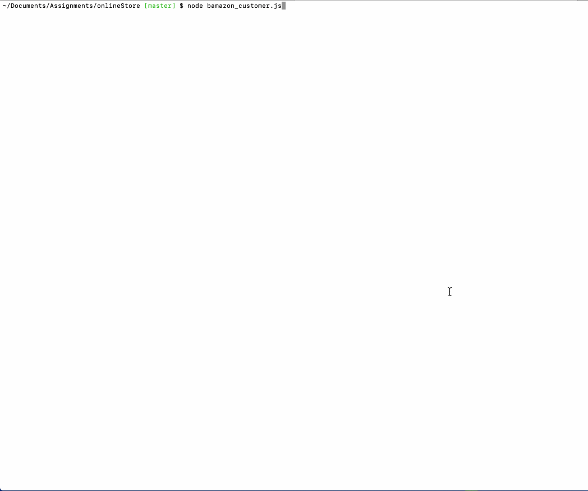

# onlineStore

Technologies used:
1. MYSQL
2. node js

In this project we have three javascript file and two sql tables which is a bash program. This project is almost any online shoping site with multiple sql queries which help customers, manager and supervisor as well.

The first table for customers, manager and supervisor has a products table with following columns:
1. item_id (unique id for each product)
2. product_name (Name of product)
3. department_name
4. price (cost to customer)
5. stock_quantity (how much of the product is available in stores)

The second table for supervisor has a departments table with following columns:
1. department_id
2. department_name
3. over_head_costs

For customers: 

1. the application will prompt the ID of the product they would like to buy and how many units of the product they would like to buy.
2. check if your store has enough of the product to meet the customer's request.
3. If the app doesn't have enough of the product, then log a phrase like `Insufficient quantity!`
4. If the app does have enough of the product, then it updates the SQL database and show the customer the total cost of their purchase.

For manager: 

It will prompt the manager for the following options:
1.  View Products for Sale
2. View Low Inventory
3. Add to Inventory
4. Add New Product
5. Quit
If a manager selects `View Products for Sale`, the app will list every available item: the item IDs, names, prices, and quantities.
If a manager selects `View Low Inventory`, then it will list all items with an inventory count lower than five.
If a manager selects `Add to Inventory`, then app will display a prompt that will let the manager "add more" of any item currently in the store.
If a manager selects `Add New Product`, it will allow the manager to add a completely new product to the store.
If a manager selects `Quit`, it will quit from the application.

For Supervisor: 
It will prompt the manager for the following options:
1. View Product Sales by Department
2. Create New Department
3. Quit

If a manager selects `View Product Sales by Department`, the app will display the following columns in a cli-table: 
1. department_id : auto increment number
2. department_name: names of all the departents in the app
3. over_head_costs: A dummy number you set for each department
4. product_sales: a product of  price of the product to the quantity of the product purchased
5. total_profit:  the difference between over_head_costs and product_sales
If a manager selects ` Create New Department`, then it will list all items with an inventory count lower than five.
prompts the supervisor for new department and followed by the over_head_cost.
If a manager selects `Quit`, it will quit from the application.

